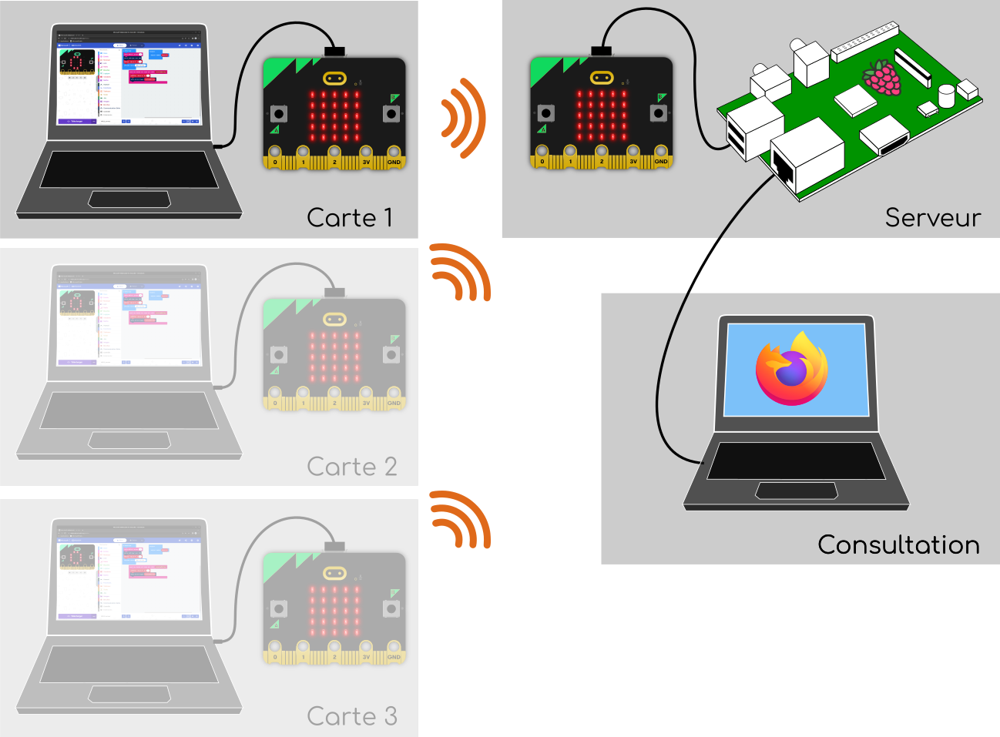

# Internet des objets avec micro:bit

Dans cette activité, vous allez utiliser des cartes
[micro:bit](https://microbit.org/fr/) pour développer une application
très simple illustrant le principe de l'[Internet des
Objets](glossaire.md#iot) ([IoT](glossaire.md#iot): Internet of Things)

## Objectifs

Les objectifs de l'activité sont de:

* Programmer et exécuter un programme simple sur une carte micro:bit,
* Échanger des messages par radio entre deux cartes micro:bit,
* comprendre les contraintes liées à la conception d'un protocole de 
  communication,
* imaginer sur cette base des activités pédagogiques transposables 
  facilement en classe.
  

## Description de l'architecture

Le système IoT est représenté sur la figure ci-dessous. Il comprend:

* Des cartes micro:bit *clientes* (une par stagiaire) qui envoient des
  messages par radio vers une autre carte micro:bit dite *serveur*.
  C'est sur cette carte que vous allez développer.

* Une carte micro:bit renvoie tous les messages qu'elle reçoit par la
  radio vers une machine *serveur* (Raspberry ou PC) au travers de la
  liaison série sur USB. 
  
* Sur ce *serveur* un logiciel interprète les messages reçus et
  représente leur contenu sur la forme de pages web consultables depuis 
  un navigateur.

    * Une première page affiche de façon synthétique les informations de
      l'ensemble des cartes. Son url est
      `http://ADDRESSE_DU_SERVEUR:8080` (remplacez `ADDRESSE_DU_SERVEUR`
      par celle qui vous sera donnée par les formateurs).

    * D'autre pages affichent de manière plus détaillées les
      informations pour chacune des cartes. Son url est
      `http://ADDRESSE_DU_SERVEUR:8080/carte/NUMERO_DE_CARTE`. Là aussi,
      remplacez `ADDRESSE_DU_SERVEUR` par celle qui vous sera donnée par
      les formateurs et `NUMERO_DE_CARTE` par le numéro qui vous a été
      assigné. **ATTENTION**: Ce numéro doit être sur deux chiffres. Par
      exemple si vous utilisez la carte n°5, vous devez utiliser la
      valeur `05` et non `5`.

## Consignes

Vous êtes chargé·e·s de développer l'application de la carte *cliente*.
Pour cela, vous devez respecter le protocole de communication qui vous
est donné [à la fin du sujet](#specification-du-protocole-format-des-messages-radio)). 

En effet, si vous ne respectez pas strictement ce protocole, le serveur
sera incapable de décoder vos messages. 

De plus, vous verrez que ce protocole permet le *multiplexage*  des
communications des différentes cartes sur le même canal radio. Si vous
ne respectez pas le protocole, vous risquez donc d'interferer avec les 
communications de vos collègues!

Enfin, prenez le temps de voir comment les messages ont été structurés
pour ce protocole. Essayez notamment de comprendre pourquoi il a été
choisi d'utiliser des délimiteurs (`;` et `:` dans notre cas) pour
séparer les informations. D'autres solutions sont possibles. Essayez
d'en imaginer et discuter de leurs avantages et inconvénients avec les
formateurs.

## Spécification du protocole (format des messages radio)

--8<-- "includes/abbreviations.md"
