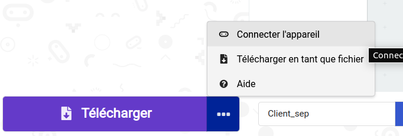
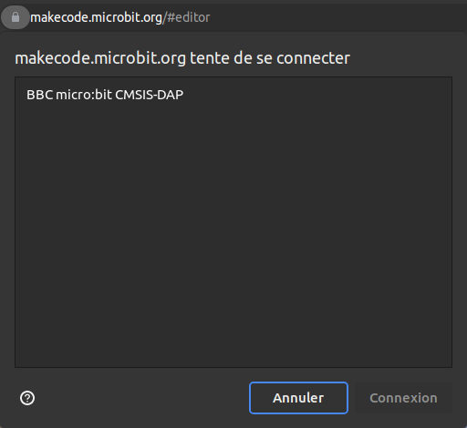

# Internet des objets avec micro:bit

Dans cette activité, vous allez utiliser des cartes
[micro:bit](https://microbit.org/fr/) pour développer une application
très simple illustrant le principe de l'[Internet des
Objets](glossaire.md#iot) ([IoT](glossaire.md#iot): Internet of Things)

## Objectifs

Les objectifs de l'activité sont de:

* Programmer et exécuter un programme simple sur une carte micro:bit,
* Échanger des messages par radio entre deux cartes micro:bit,
* comprendre les contraintes liées à la conception d'un protocole de 
  communication,
* imaginer sur cette base des activités pédagogiques transposables 
  facilement en classe.
  

## Description de l'architecture

La carte Micro:bit ne peut pas se connecter seule à internet. Nous
mettrons en oeuvre un dispositif s'appuyant sur une carte Raspberry Pi
(ou PC sous Linux) pour récupérer des données captées par plusieurs
cartes Micro:bit sur une page web, accessibles depuis un ordinateur.

Le système IoT est représenté sur la figure ci-dessous. Il comprend:

* Des cartes micro:bit *clientes* (une par stagiaire) qui envoient des
  messages par radio vers une autre carte micro:bit dite *serveur*.
  C'est sur cette carte que vous allez développer.

* Une carte micro:bit renvoie tous les messages qu'elle reçoit par la
  radio vers une machine *serveur* (Raspberry ou PC) au travers de la
  liaison série sur USB. 
  
* Sur ce *serveur* un logiciel interprète les messages reçus et
  représente leur contenu sur la forme de pages web consultables depuis 
  un navigateur.

    * Une première page affiche de façon synthétique les informations de
      l'ensemble des cartes. Son url est
      `http://ADDRESSE_DU_SERVEUR:8080` (remplacez `ADDRESSE_DU_SERVEUR`
      par celle qui vous sera donnée par les formateurs).

    * D'autre pages affichent de manière plus détaillées les
      informations pour chacune des cartes. Son url est
      `http://ADDRESSE_DU_SERVEUR:8080/carte/NUMERO_DE_CARTE`. Là aussi,
      remplacez `ADDRESSE_DU_SERVEUR` par celle qui vous sera donnée par
      les formateurs et `NUMERO_DE_CARTE` par le numéro qui vous a été
      assigné. **ATTENTION**: Ce numéro doit être sur deux chiffres. Par
      exemple si vous utilisez la carte n°5, vous devez utiliser la
      valeur `05` et non `5`.

{width=10}

<!-- { width="75%" } -->

## Consignes

Vous êtes chargé·e·s de développer l'application de la carte *cliente*.
Pour cela, vous devez respecter le protocole de communication qui vous
est donné [à la fin du
sujet](#specification-du-protocole-format-des-messages-radio)). Si vous
souhaitez l'exploiter en classe, le code source des autres parties est
disponible librement sur [ce dépôt
Github](https://github.com/whaou/mpls-reseaux-code).

Si vous ne respectez pas strictement ce protocole, le serveur sera
incapable de décoder vos messages. 

De plus, vous verrez que ce protocole permet le *multiplexage*  des
communications des différentes cartes sur le même canal radio. Si vous
ne respectez pas le protocole, vous risquez donc d'interferer avec les 
communications de vos collègues!

Enfin, prenez le temps de voir comment les messages ont été structurés
pour ce protocole. Essayez notamment de comprendre pourquoi il a été
choisi d'utiliser des délimiteurs (`;` et `:` dans notre cas) pour
séparer les informations. D'autres solutions sont possibles. Essayez
d'en imaginer et discuter de leurs avantages et inconvénients avec les
formateurs.

## Comment commencer?

* Lancez la machine virtuelle tel que décrit dans la page sur
  [l'environnement de développement à IMT
  Atlantique](activite-environnement-imta.md).
* Lancer le navigateur Chromium (version libre de Chrome) en cliquant 
  sur l'icône correspondante: {: style="width:30px"}
* **Bon à savoir:** MakeCode, l’environnement de développement web pour
  les cartes micro:bit utilise la librairie `WebUSB` qui n'est pas prise
  en charge par Firefox pour des raisons de sécurité. si vous utilisez
  Firefox, vous pourrez travailler en simulation mais pas transferer 
  directement vos programmes dans les cartes (cela reste possible mais 
  moins pratique à faire).
* Connectez-vous au site de MakeCode: [https://makecode.microbit.org/](https://makecode.microbit.org/).
* Commencez un nouveau projet.
* Vérifiez que vous arrivez bien à programmer votre carte:
    * Réalisez un programme très simple (par ex. en affichant un symbole 
      sur le panneau de LEDs).
    * Branchez votre carte et transférez la gestion de son port USB à la
      VM comme indiqué sur la page [environnement de développement à IMT
      Atlantique](activite-environnement-imta.md).
    * La première fois, il faut associer votre carte. Pour cela, cliquez
      sur les trois points à droite du bouton "Télécharger" situé en bas
      à gauche. Sélectionnez "Connecter l'appareil" et suivez la 
      procédure. 
      Attention à bien sélectionner "BBC micro:bit CMISS-DAP" au moment 
      où la fenêtre correspondante le demande.
      {: style="width:40%"}  
      {: style="width:40%"}
    * Si tout s'est bien déroulé, vous devriez désormais pouvoir 
      télécharger vos programmes en cliquant simplement sur 
      "Télécharger".

## Spécification du protocole (format des messages radio)

Compte tenu des limites de l'environnement de développement par bloc, et
afin de limiter la complexité, il a été choisi d'utiliser un protocole 
en *mode texte*. Cela signifie que les messages sont codés sous la forme
de chaînes de caractères "lisibles par un humain". L'alternative aurait 
été d'utiliser un protocole *binaire*. N'hésitez pas à interroger les 
formateurs pour en apprendre d'avantage à ce sujet.

Par ailleurs, il est important de savoir que le cartes micro:bit ne sont
pas capables d'envoyer sur la radio des messages de plus de 19 octets.
Le protocole limite donc la taille des messages à 19 caractères au
maximum.

* **Entête**: Tous les messages commencent par `C:xx` où `xx` représente
  le numéro de la carte codé sur deux caractères (par ex. `05` pour la
  carte n°5). La valeur `00` est réservée. Le protocole est donc capable
  de gérer jusqu'à 99 cartes.
* **Champs**: Un message peut contenir différents champs, dans la 
  limite de 19 caractères maximum. 
    * Les différents champs sont séparés entre eux par le caractère `;`.
      Ce caractère ne doit pas être utilisé pour autre chose que la 
      séparation des champs. Il est donc notamment interdit à 
      l'intérieur des autres chaînes de caractère
    * L'entête décrit ci dessus est obligatoirement présent en tête de 
      chaque message.
    * Tous les champs respectent un format de type `type:valeur` où
        * La `type` définit le type de champ
        * Le format de `valeur` dépend du type de champ
        * `type` et `valeur` sont séparés par le délimiteur `:`. Ce 
          caractère est donc interdit à l'intérieur des types.
* **Types de champs**: les types de champs suivants sont définis:
    * `NAME`: La `valeur` de ce champ est de type chaîne de caractère.
      Elle contient le nom de la carte.
    * `TEXT`: La `valeur` de ce champ est de type chaîne de caractère.
      Elle contient une chaîne de caractère à transmettre au serveur.
    * `A`: La `valeur` de ce champ est '0' ou '1'. Elle représente
      l'état du bouton A de la carte micro:bit.
    * `B`: La `valeur` de ce champ est '0' ou '1'. Elle représente
      l'état du bouton B de la carte micro:bit.
    * `AB`: La `valeur` de ce champ est '0' ou '1'. Elle représente
      l'état du bouton AB (paire constituée des boutons A et B appuyés
      simultanément) de la carte micro:bit.
    * `P0`, `P1` et `P2`: La `valeur` de ce champ est '0' ou '1'. Elle
      représente respectivement l'état des broches `P0`, `P1` ou `P2` de
      la carte micro:bit.
    * `MVT`: La `valeur` de ce champ est de type chaîne de caractère.
      Elle décrit le type de mouvement mesuré par la carte. **NOTE:**
      Pour être complet, une liste des valeurs possibles devrait être
      indiquée...
    * `VAL`: La `valeur` de ce champ est de type flottant (ou entier).
      Elle contient une chaîne de caractère à transmettre au serveur.
    * `TEMP`: La `valeur` de ce champ est de type flottant (ou entier).
      Elle contient la valeur de la température mesurée par la carte
      micro:bit.
    * `PITCH`: La `valeur` de ce champ est de type flottant (ou entier).
      Elle contient la valeur de l’orientation que la carte micro:bit a
      mesurée sur l'axe *pitch*.
    * `ROLL`: La `valeur` de ce champ est de type flottant (ou entier).
      Elle contient la valeur de l’orientation que la carte micro:bit a
      mesurée sur l'axe de *roulis*.
    * `ACCX`, `ACCY` et `ACCZ`: La `valeur` de ce champ est de type
      flottant (ou entier). Elle contient la valeur de l’accélération
      que la carte micro:bit a mesurée respectivement sur l'axe x, y ou
      z.
    * `R`: Ce type de champ sert à transmettre des codes couleur codés
      en RVB. La `valeur` de ce champ est une suite de trois entiers
      séparés par des `,` qui contiennent respectivement les valeurs des
      composantes rouge, verte et bleue.

**Exemples:**

* le message `C:02;ROLL:7` indique que le capteur de la carte n°2 a lu
  la valeur `7`sur l'axe de roulis.
* le message `C:21;R:0,255,255` indique que la carte n°21 transmet la 
  couleur jaune
* le message `C:03;A:0;B:1;P0:1` indique que sur la carte n°3 transmet la 
    * le bouton A est relâché,
    * le bouton B est appuyé et
    * une tension est présente sur la broche P0.

--8<-- "includes/abbreviations.md"
