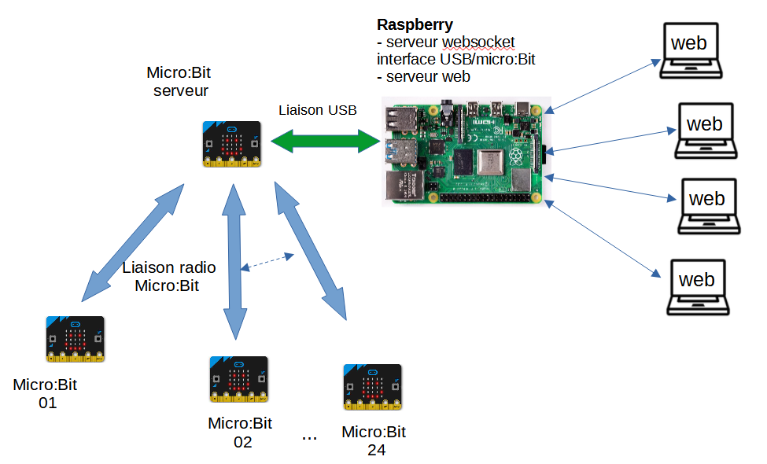

# Internet des objets avec micro:bit

## Utiliser microbit dans un projet IoT

La carte Micro:bit ne peut pas se connecter seule à internet.
Nous mettrons en oeuvre un dispositif s'apuyant sur une carte Raspberry Pi (ou PC sous Linux) pour récupérer des données captées par plusieurs cartes Micro:bit sur une page web, accessibles depuis un ordinateur.

{ width="75%" }

* une carte microbit Maître connectée au raspberry PI par un câble USB. Elle échange avec les microbit esclaves via radio.
* de 1 à 24 cartes microbit esclave. Elles récupèrent des données de 1 ou plusieurs capteurs et les transmettent sur demande à la carte microbit maitre via radio (groupe radio 1).

TODO...

--8<-- "includes/abbreviations.md"
