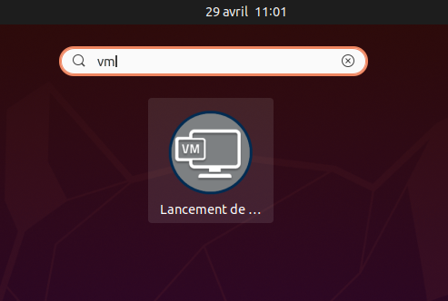

# Les machines de TP à IMT Atlantique

À IMT Atlantique, les machines de TP fonctionnement sous Linux. Chaque
utilisateur dispose d'un compte personnel (login/mot de passe) pour s'y
connecter.

Dans cet environnement, les utilisateurs disposent de droits restreints
afin de les empêcher de "casser" la configuration des machines.

En TP, il est souvent nécessaire de disposer des droits *administrateur* 
afin par exemple d'installer de nouveaux logiciels, de modifier 
certaines configuration ou de générer ou de capturer du trafic réseau.

Pour cela, nous utilisons des machines virtuelles ([VM](glossaire.md#vm))
Vous allez donc travailler dans ce type d'environnement.

## Lancement de la [VM](glossaire.md#vm) "MPLS"

* Lancez l'application "Lancement de VM" depuis l'interface graphique.
  Pour cela:
    * Appuyez sur la touche "Super" du clavier (aussi appelée touche 
      "Windows") pour lancer l'invite "Gnome Shell". Puis,
    * Tapez "VM", et
    * Cliquez sur l'icône de l'application.
    * Sélectionnez ensuite la [VM](glossaire.md#vm) "TP-MPLS" et lancez 
      la en cliquant sur le bouton "Valider".
* La [VM](glossaire.md#vm) devrait se lancer au bout de quelque temps.

*Icône de lancement du gestionnaire de VM*

## Transfert du contrôle des ports USB à la [VM](glossaire.md#vm)

Dans l'activité 
["Internet des objets avec micro:bit"](activite-IoT-micro-bit.md), nous 
allons programmer les cartes micro:bit depuis la [VM](glossaire.md#vm). 
Pour cela, il sera nécessaire que la machine physique délègue à la 
[VM](glossaire.md#vm) le contrôle du périphérique USB représentant la
carte micro:bit. Pour cela, il faut:

* Brancher la carte micro:bit sur l'un des ports USB de la machine hôte.
* Puis, ouvrir le menu `Fichier->Sélection du périphérique USB` de la 
  fenêtre de la [VM](glossaire.md#vm).
* Sélectionner le périphérique `ARM "BBC micro:bit CMSIS-DAP"`.
* Cliquer sur "Fermer"

À partir de ce moment, la carte n'est plus "vue" par le PC hôte mais 
depuis la [VM](glossaire.md#vm).

**NOTE:** Il est nécessaire de refaire cette manipulation à chaque fois 
que la carte est débranchée du PC hôte.

--8<-- "includes/abbreviations.md"
