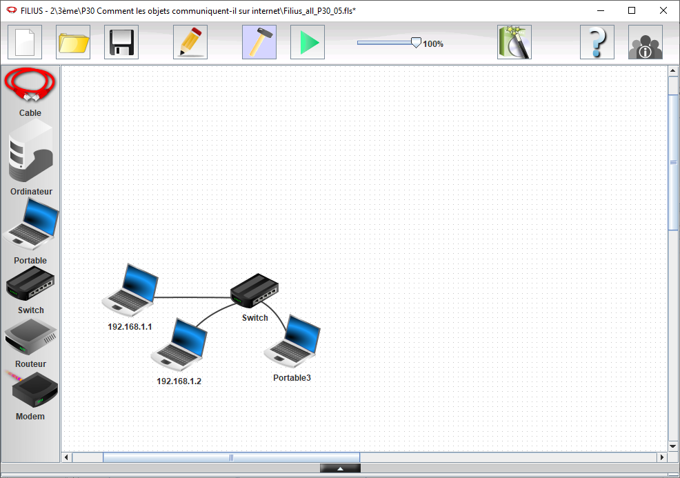
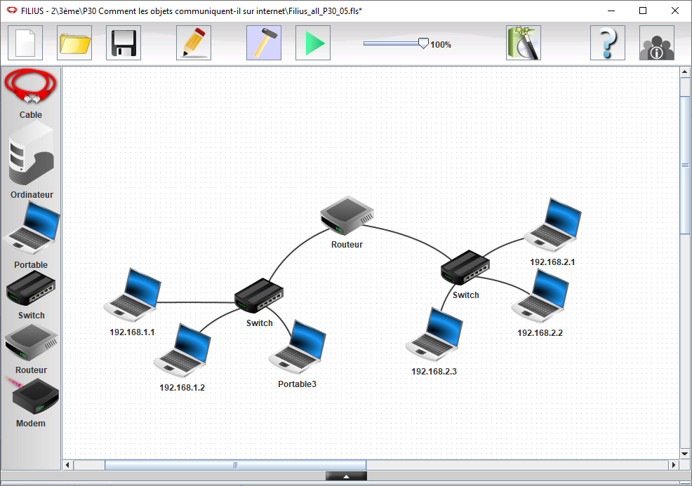
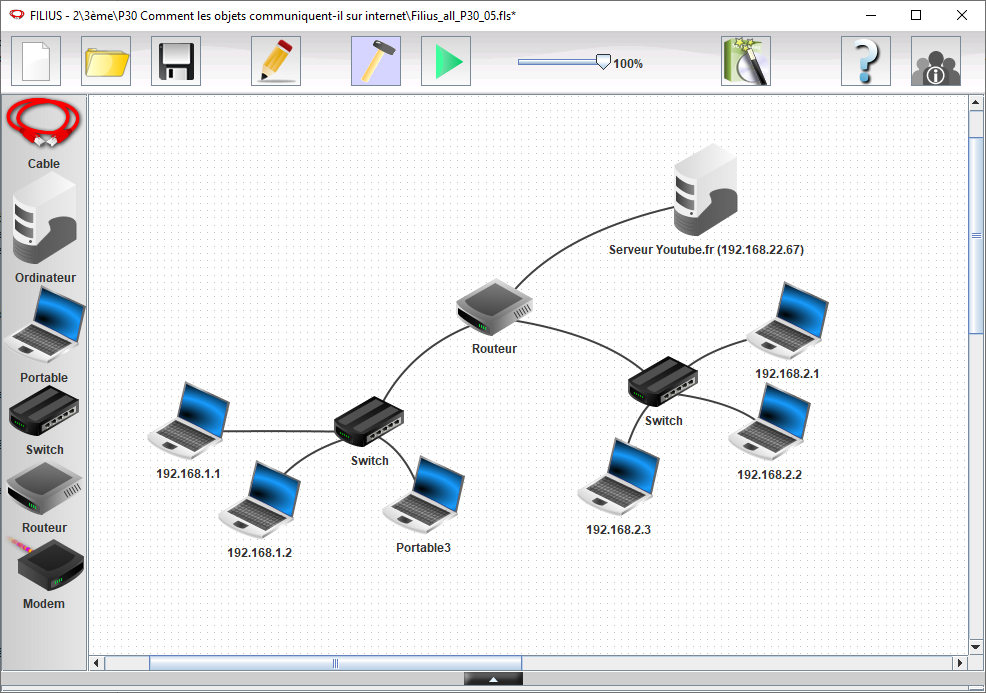
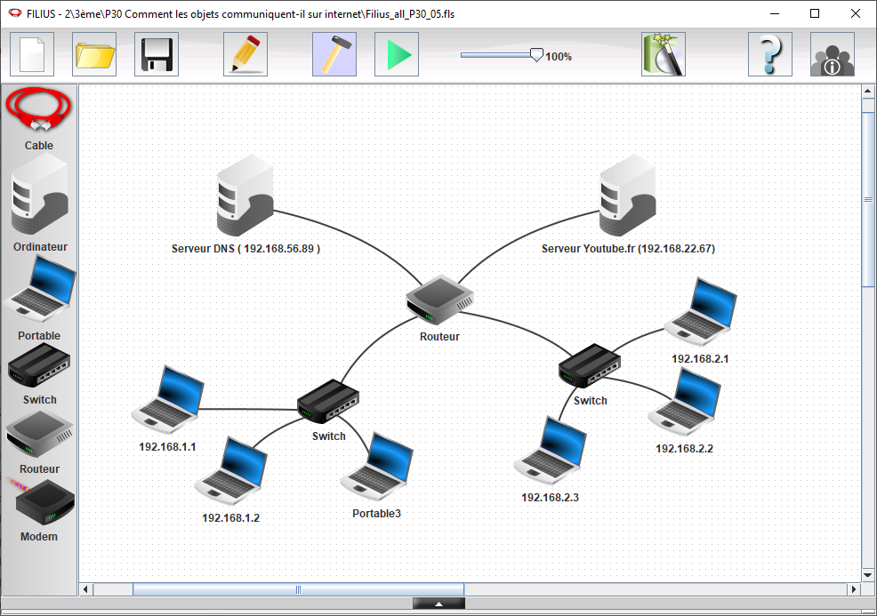

# Simulation réseau avec Filius

Cette activité a pour objectifs de:

* découvrir le simulateur de réseau Filius
* modéliser un réseau dans Filius
* identifier les composants d'un réseau local et leurs paramètres de 
  configuration 
* comprendre le principe de la résolution d'adresse en observant 
  le fonctionnement d'un réseau local

## Présentation de filius

* lien vers le [site officiel de Filus (en allemand)](https://www.lernsoftware-filius.de/Herunterladen)
* [lien vers un exemple d'activité](https://ent2d.ac-bordeaux.fr/disciplines/sti-college/2019/09/25/filius-un-logiciel-de-simulation-de-reseau-simple-et-accessible/)

## Partie 1: Saisie d'un schéma réseau et Configuration des adresses sur ce réseau

{ width="75%" }

* Dessiner un réseau avec 3 machines "PC portables" (adresses IP `192.168.1.1` ; `192.168.1.2` ; `192.168.1.3` ) + switch
* "installer" des logiciels sur les PC virtuels la "Ligne de commande"
* Tester la communication entre 2 PCs avec la commande `ping`

Correction : [Correction Filius Partie 1](resources/Filius_1.fls)

### AIDE outils en ligne de commande :
* `ipconfig` : qui permet de connaître la configuration réseau de la machine sur laquelle est exécutée cette commande (`ipconfig` est une véritable commande sous Windows. Sous Linux, vous pouvez utiliser `ifconfig` (obsolète) ou bien `ip`.)
* `ping` : qui permet d'envoyer des paquets de données d'une machine A vers une machine B. Si la commande est exécutée sur la machine A, le `ping` devra être suivi par l'adresse IP de la machine B (par exemple, si l'adresse IP de B est `192.168.1.2`, on aura `ping 192.168.1.2`

## Partie 2: Configuration d'un second réseau local 

{ width="75%" }

* Configurer un nouveau réseau démarrant par `192.168.2.xxx` avec 3 nouvelles machines "PC portables".
* IP des 3 machines `192.168.2.1` ; `192.168.2.2` ; `192.168.2.3`.
* Réalisez les paramètres nécessaires en ajoutant un routeur afin de permettre la communication entre les deux réseaux.
* Vérifiez le bon fonctionnement de communication entre les deux réseaux, toujours avec la commande `ping`.
* Les "PC portables" sont a reconfigurer avec l'IP du Routeur/Passerelle

Correction : [Correction Filius Partie 2](resources/Filius_2.fls)

## Partie 3: Serveur WEB 

{ width="75%" }

* Ajouter un serveur, "PC fixe", que vous appelez "Youtube.fr" avec l’adresse IP  qui n'est ni en `192.168.1.x` ni `192.168.2.x`. Par exemple : `192.168.20.200`.
* Sur ce serveur, "Installer" un "serveur web", "Explorateur de fichier", "Editeur de texte".
* "Installer" sur quelques "PC portable" un "navigateur web".
* Depuis un "PC portable" vous devriez pouvoir visualiser la page disponible sur le "serveur web" en utilisant sont adresse IP dans le navigateur.

Correction : [Correction Filius Partie 3](resources/Filius_3.fls)

## Partie 4 (Bonus) : Serveur [DNS](glossaire.md#dns)

{ width="75%" }

* Ajouter un nouveau serveur, "PC fixe", que vous appelez `DNS` avec une adresse IP  qui n'est ni en `192.168.1.x` ni en `192.168.2.x`. Par exemple : `192.168.100.100`.
* Sur ce serveur, "Installer" un "serveur [DNS](glossaire.md#dns)".
* Vous devez configurer l'adresse IP du serveur "Youtube.fr" et l'associer a son adresse IP.
* Les "PC portable" sont a reconfigurer avec l'IP du [DNS](glossaire.md#dns).
* Depuis un "PC portable" vous devriez pouvoir visualiser la page disponible sur le "serveur web" en utilisant cette fois si son nom de domaine "Youtube.fr".

Correction : [Correction Filius Partie 4](resources/Filius_4.fls)

## Partie 5 (Super Bonus): Serveur [DHCP](glossaire.md#dhcp)

Configurez Filius pour qui émule le fonctionnement d'un serveur
[DHCP](glossaire.md#dhcp). Les machines récupéreront ainsi
automatiquement leurs paramètres réseau:

* leur adresse IP et leur masque de sous-réseau,
* l'adresse de leur routeur par défaut et
* l'adresse du serveur [DNS](glossaire.md#dns).

Il faut noter qu'en réalité la fonctionnalité [DHCP](glossaire.md#dhcp)
est assurée par un équipement physique sur le réseau. Dans la grande
majorité des cas, c'est le routeur d'accès (routeur par défaut,
typiquement la box de la maison) qui l'assure.

## Ressources : 
* [vidéos ressources  Filius - Comment connecter plusieurs réseaux ensemble ?](https://www.youtube.com/watch?v=bkaRSt5TUbY)
* [Comment mettre en place un serveur Web ](https://www.youtube.com/watch?v=pS_rpzolCy8)
* [Comment se connecter à un serveur par son adresse URL ?](https://www.youtube.com/watch?v=aHAmIwBhZdU)
* [Genial.ly de présentation](https://view.genial.ly/6272924086ebe00018d2ac39/presentation-secrets-des-reseaux-2022)

--8<-- "includes/abbreviations.md"
